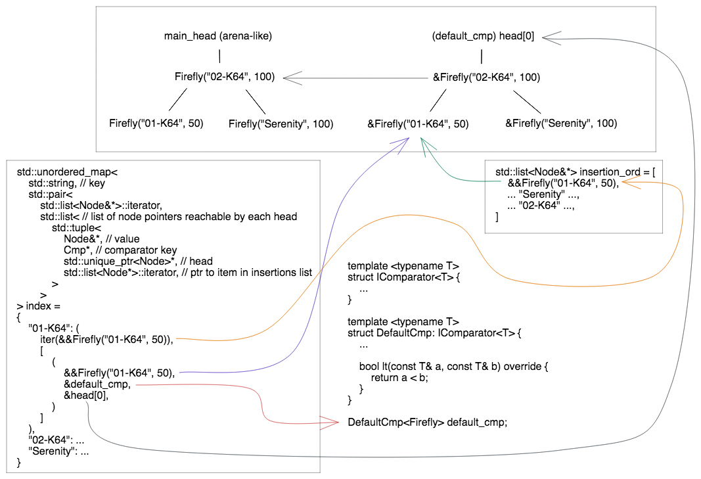

# Instantiation of V-Index and Add Data

```c++
auto vin = VIndex(make_extractor(Firefly, name)); // index Firefly::name
vin.emplace("01-K64", 50);
vin.emplace("Serenity", 100);
vin.emplace("02-K64", 100);
```

Underneath all of this, the V-Index populates an maintains properties for an AVL tree, a hashmap, and a linked list:



We get things like

- ordering for O(Nlog(N)) traversal over the entire collection
- O(log(N)) read of either the minimum or maximum elements in that collection 
- O(1) read of an element, given a key that represents the indexed data member
- O(N) insertion ordered traversal over the collection
- O(1) read ends of insertion ordered linked list
- O(log(N)) removal

[prev](part3.md)|[next](part5.md)
