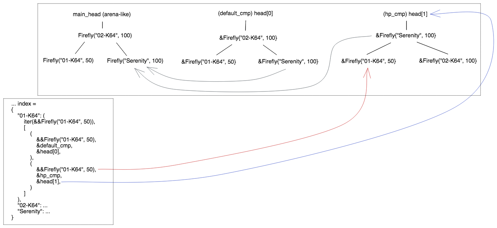

# Asking the V-Index for Another Ordering of Data

```c++
struct HpCmp: IComparator<Firefly> {
    ...

    bool lt(const Firefly& a, const Firefly& b) override {
        return a.hp < b.hp;
    }
}
auto hp_cmp = HpCmp();
auto it = vin.cbegin(OrderType::INORDER, hp_cmp); // generate auxiliary AVL tree 
```

Internally, the v-index adds another AVL tree:



[prev](part4.md)|[next](part6.md)
