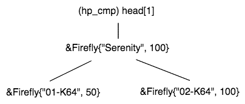
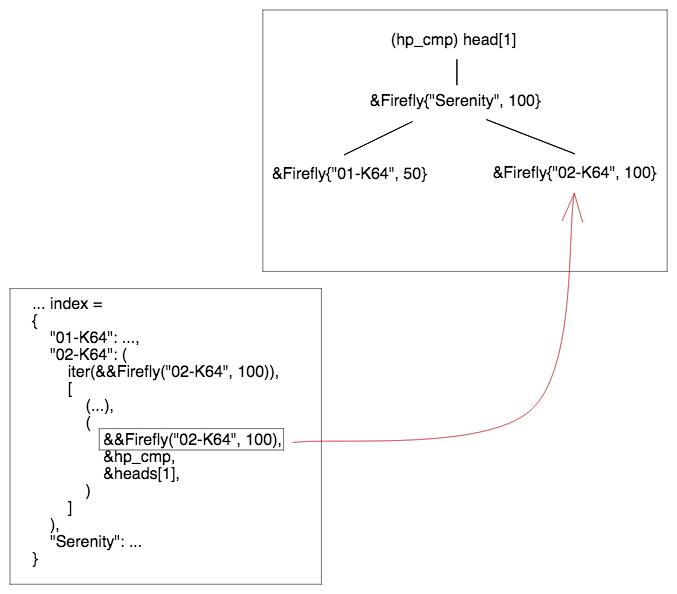

# Results

Designing the v-index with single ownership as the driving memory management scheme fit the problem very well. 
- With a mutable pointer/reference to an `std::unique_ptr`, it was easy to leverage move semantics. When editing a tree on remove, subtrees can be moved out temporarily for update, then moved back into the `std::unique_ptr` that represents the left or right child of a parent node.  
- Additionally, it was important that C++ does not constrain itself to aliasability XOR mutability (AxM) because it allowed for both insert and remove operations to be optimally implemented in conjunction, and at convenience. 
    - An insert operation requires mutability from the root of the tree. As a node is inserted, it recurses through the root node, and so each node that is passed through needs to give update permissions. This is of course O(log(N)).
    - A removal operation faces the challenge in that AVL trees with *non-index* comparator keys can have nodes with equivalent keys:  
    - For this reason, mutable references, pointing into each AVL tree, were added to allow constant time access to the target node:  While this was still O(log(N)), it was convenient in that it avoided a large scale refactor, which otherwise, would have probably resulted in thrashing or API churn.
- Memory management, as expected, was automated through the natural single ownership model of a parent node and its children. Because of this, excessive refactoring was avoided. 
- Transitioning into Rust was relatively less daunting.

[prev](part6.md)
